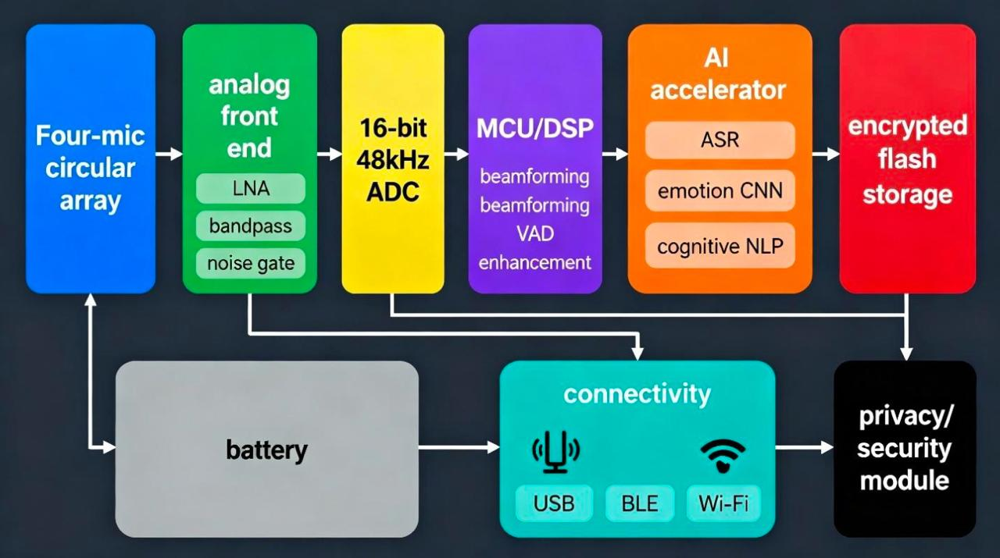
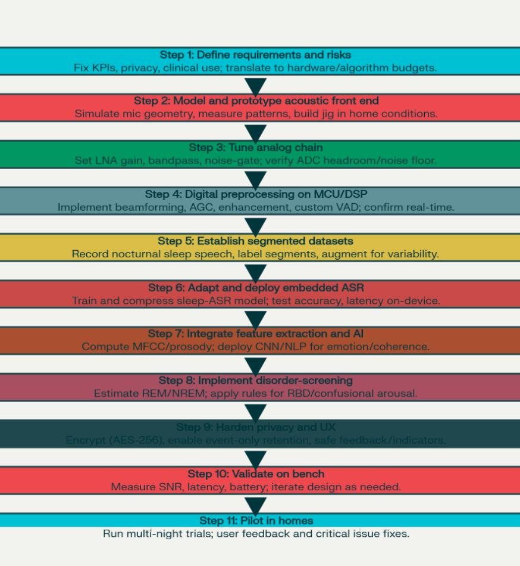
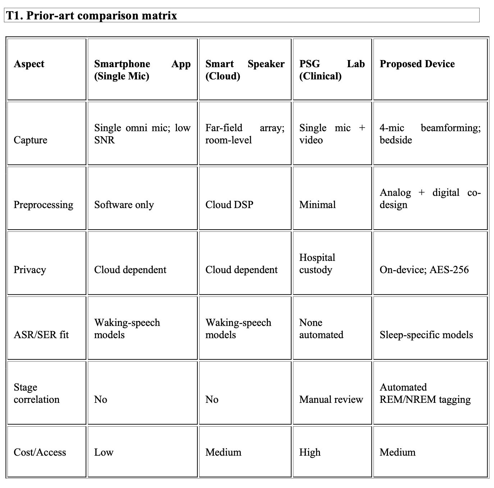

# Sleep-Talking Pattern Classifier for Emotional & Cognitive State Analysis

## Overview

Sleep-Talking Pattern Classifier for Emotional & Cognitive State Analysis is an AI-driven healthcare technology project designed to detect, analyze, and classify sleep-talking (somniloquy) events in home environments.

The system combines advanced audio signal processing, speech recognition, emotion analysis, cognitive state assessment, and sleep-stage correlation to provide meaningful insights into nocturnal vocalizations while maintaining strict privacy through on-device processing.

Unlike conventional sleep-monitoring applications, the proposed system focuses on privacy-preserving analytics, event-based recording, and intelligent screening for sleep-related disorders.

---

## Problem Statement

Sleep-talking is a common parasomnia that is often overlooked due to the absence of reliable and privacy-preserving monitoring solutions.

Existing solutions frequently suffer from:

- Continuous audio recording and privacy concerns
- Poor detection accuracy in noisy environments
- Lack of emotion and cognitive state analysis
- Dependence on cloud-based processing
- Limited clinical usefulness

This project addresses these limitations through a dedicated AI-enabled platform capable of detecting and analyzing sleep-talking events in real-world environments.

---

## Objectives

- Detect and isolate sleep-talking events
- Improve speech capture quality using advanced signal processing
- Perform on-device Automatic Speech Recognition (ASR)
- Classify emotional states from sleep speech
- Analyze cognitive coherence of detected utterances
- Correlate vocalizations with sleep stages
- Support early screening of sleep-related disorders
- Ensure secure and privacy-preserving data handling

---

## Key Features

### Audio Processing
- Multi-microphone beamforming
- Noise reduction
- Spectral enhancement
- Dereverberation
- Sleep-optimized Voice Activity Detection (VAD)

### Speech Analytics
- Automatic Speech Recognition (ASR)
- Sleep-speech adaptation
- Event segmentation

### Emotion Classification
- Neutral
- Happy
- Sad
- Angry
- Fearful

### Cognitive Analysis
- Coherent speech detection
- Incoherent/confused speech detection
- Confidence-based interpretation

### Clinical Monitoring Support
- REM/NREM correlation
- Parasomnia screening
- REM Behavior Disorder (RBD) flagging
- Nightly trend analysis

### Privacy & Security
- AES-256 encryption
- Local event-based storage
- User-controlled data export
- Privacy-first architecture

---

# System Architecture

  

This diagram illustrates the complete architecture of the proposed sleep-talking analysis system, including audio acquisition, signal preprocessing, AI inference modules, encrypted storage, and secure connectivity.

---

# Design Flow

  

The workflow demonstrates the end-to-end development and implementation pipeline of the project, from requirement analysis to deployment and validation.

---

# Prior-Art Comparison

  

Comparison between the proposed system and existing sleep-monitoring approaches in terms of privacy, preprocessing, speech analytics, and clinical usability.

---
## Technologies & Concepts

- Artificial Intelligence
- Machine Learning
- Deep Learning
- Natural Language Processing (NLP)
- Speech Emotion Recognition
- Automatic Speech Recognition (ASR)
- Signal Processing
- TinyML
- Edge AI
- Embedded Systems
- Healthcare Analytics

---

## Expected Outcomes

- Reliable sleep-talking detection
- Emotion-aware speech analysis
- Cognitive pattern assessment
- Privacy-preserving health monitoring
- Improved support for sleep disorder screening

---

## Applications

- Sleep Disorder Monitoring
- Healthcare Analytics
- Clinical Sleep Research
- Behavioral Health Assessment
- Home-Based Sleep Monitoring
- AI-Assisted Health Technologies

---

## Future Scope

- Multi-user voice separation
- Mobile application integration
- Wearable sensor connectivity
- Real-time monitoring
- Clinical deployment and validation
- Advanced multimodal sleep analysis

---

## Team Project

This project was developed as a collaborative academic research project by:

- Manmoy Khastagir
- Sriporna Biswas
- Md Mahdi Hasan

under the guidance of the project supervisor at Chandigarh University.

---

## My Contributions

As a co-author and team member, my primary contributions included:

- Literature review and background research
- Problem definition and requirement analysis
- System workflow and architecture planning
- AI-based solution conceptualization
- Documentation and technical report preparation
- Performance evaluation planning
- Research coordination and project development support

---

## Authors

Sriporna Biswas  
Bachelor of Engineering (Computer Science & Engineering)  
Chandigarh University

---

## License

This project is intended for academic and research purposes.
